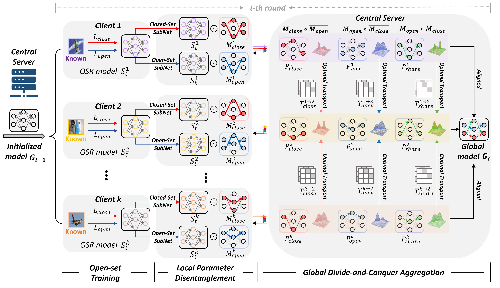

# FedPD: Federated Open Set Recognition with Parameter Disentanglement

 [](https://www.gnu.org/licenses/gpl-3.0) 

Official implementation of the paper [FedPD: Federated Open Set Recognition with Parameter Disentanglement](https://openaccess.thecvf.com/content/ICCV2023/papers/Yang_FedPD_Federated_Open_Set_Recognition_with_Parameter_Disentanglement_ICCV_2023_paper.pdf) (**ICCV 2023**).

<!-- **FedPD is the first work of federated learning for open-set recognition.** -->

Please use the following bib entry to cite the paper if you are using resources from this repo.

```
@InProceedings{Yang_2023_ICCV,
    author = {Yang, Chen and Zhu, Meilu and Liu, Yifan and Yuan, Yixuan},
    title = {FedPD: Federated Open Set Recognition with Parameter Disentanglement},
    booktitle = {IEEE/CVF International Conference on Computer Vision (ICCV)},
    year = {2023},
}
```

<!--  -->


### Dataset & Pretrained Modeel
**Benchmark(Digits)**
- Please download our pre-processed datasets [here](https://mycuhk-my.sharepoint.com/:u:/g/personal/1155149226_link_cuhk_edu_hk/EV1YgHfFC4RKjw06NL4JMdgBMU21CegM12SpXrSmGjt3XA?e=XK2rFs), put under `data/` directory and perform following commands:
    ```bash
    cd ./data
    unzip digit_dataset.zip
    ```

<!-- Robust/Efficient Model Personalization in Federated Medical Image Segmentation via Domain-Aware Representation Learning

Heterogeneity-aware Model Personalization in Federated Medical Image Segmentation via Domain-Aware Masked Autoenco -->
